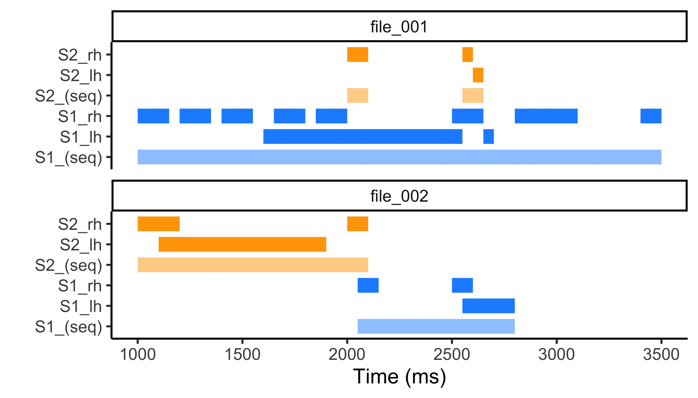

# Repo with random R functions/scripts

## ELAN functions

### `read_eaf()`
Function based on original from the [`signglossR`](https://github.com/borstell/signglossR) package. Reads either all ELAN files (`.eaf`) from a directory (if path is set to a directory) or an individual file (if path is set to a file). Returns a tibble dataframe with all the data.

**Example:**
```
# Read all the EAF files of the directory into a single tibble dataframe
all_eafs <- read_eaf(path="/Users/username/Desktop/Corpus/EAFs/")

# Read an individual EAF file into a single tibble dataframe
my_eaf <- read_eaf("/Users/username/Desktop/Corpus/EAFs/FrogStory_2022-12-01.eaf")
```


### `split_elan_videos()` (requires `ffmpeg` installed)
Uses the `read_eaf()` function to first read an ELAN file (or all ELAN files in a directory) and then split one (if single file path) or more (if entire directory) video files into clips corresponding to the segments on a tier in the ELAN file running `ffmpeg` commands. The tier used for segmentation needs to be provided. Default input and output video file format is `.mp4` but can be specified with the arguments. Padding can be added with positive or negative values (in milliseconds) adding/removing frames at the beginning and end of the individual clips relative to the cell segment durations.

**Usage:**
```
split_elan_video(elan_path = "/path/to/eaf/file(s)",
                 segmentation_tier = "name_of_segmentation_tier",
                 video_path = "/path/to/video/file(s)",
                 annotation_tag = T, # will add contents of ELAN cells in output filenames
                 padding = 0, # adds (or subtracts if negative) frames (in milliseconds) before+after segment duration
                 video_input_format = ".mov", # specify input video format in directory (default is .mp4)
                 video_output_format = ".mp4") # specify output video format (default is .mp4)
```

**Example:**
```
# Split all videos (.mov) with file names mirroring the EAF file names and output .mp4 files
split_elan_video(elan_path = "/Users/username/Desktop/Corpus/EAFs/",
                 segmentation_tier = "name_of_segmentation_tier",
                 video_path = "/Users/username/Desktop/Corpus/videos/",
                 annotation_tag = T,
                 video_input_format = ".mov", 
                 video_output_format = ".mp4")

# Split a specific video based on an EAF file with a different name, adding 100 milliseconds before and after each segment
split_elan_video(elan_path = "/Users/username/Desktop/Corpus/EAFs/FrogStory_2022-12-01.eaf",
                 segmentation_tier = "name_of_segmentation_tier",
                 video_path = "/Users/username/Desktop/Corpus/videos/FrogStory_Signer012.mp4",
                 annotation_tag = T,
                 padding = 100)
```

## Segment ELAN "turns" (`segment_elan_turns.R`)

### `turn_seq()`
Lets you merge sequences of annotations (in an ELAN type format) into longer utterances ("turns") based on the chronological order of the annotations' start times within each file.



### `turn_interval()`
Lets you merge sequences of annotations (in an ELAN type format) into longer utterances ("turns") based on the chronological order of the annotations' start times and a defined interval of maximum allowed duration to the next annotation, by participant (e.g., signer/speaker) within each file.


### `turn_quant()`
Lets you merge sequences of annotations (in an ELAN type format) into longer utterances ("turns") based on the participant who is uttering the most within each window of 3 annotations chronologically based on the annotations' start times within each file.


## Pacific-centered map

The file `pacific_map.R` contains a simple outline for a Pacific-centered basemap using `ggplot2`. Pacific-centered maps are often preferred in e.g. linguistics. 


See also Hedvig Skirgårds solution for Pacific-centered (language) maps in R: [HedvigS: Worldmap plotting](https://github.com/HedvigS/personal-cookbook/blob/main/R/Worldmap_plotting.R)
